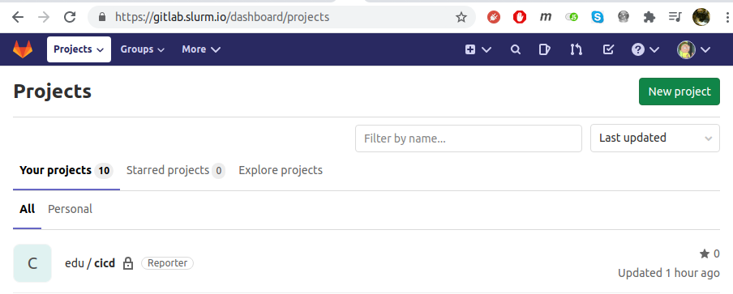
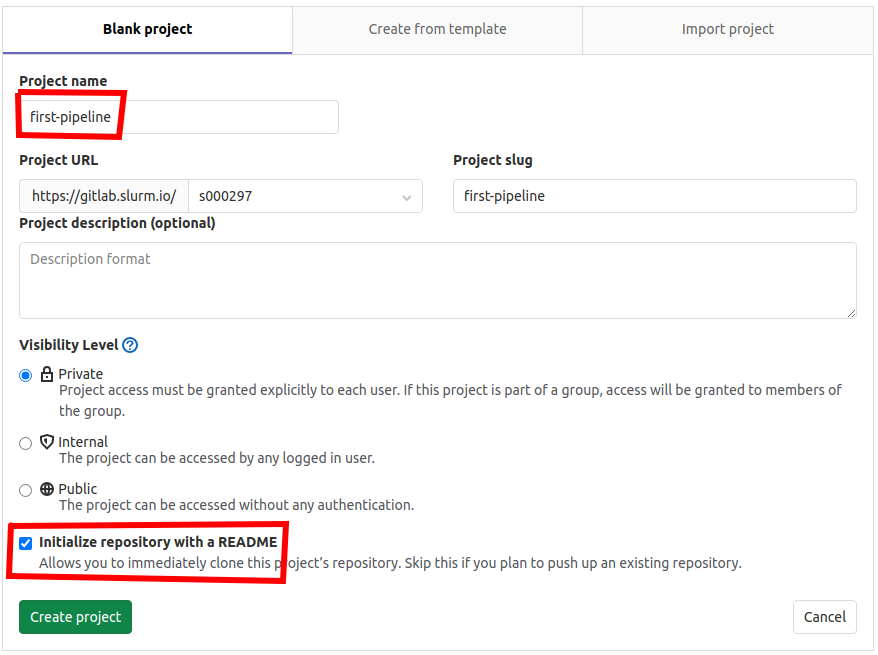

# 02 - Как работают CI/CD системы

## Requirements

- Git
- Docker

## Создание репозитория и запуск раннера и пайплайна

После настройки окружения, как описано в [общем README](../README.md), можно приступить к созданию и настройке репозитория с пайплайном.

Для начала перейдите по ссылке [https://gitlab.slurm.io/dashboard/projects](https://gitlab.slurm.io/dashboard/projects) и создайте новый проект под названием `first-pipeline` (название имеет смысл взять именно такое, иначе некоторые скрипты не будут отрабатывать и придётся выполнять ручные действия):





Выберите Initialize this project with a README, чтобы сразу же склонировать репозиторий.

Теперь выполните следующие команды:

```bash
export SLURM_HOME=$HOME/Slurm.io # домашняя директория курса по-умолчанию
cd $SLURM_HOME/cicd/02-lecture
. init.sh
```

Затем скоируйте скрипты для запуска раннера в рабочее пространство и склонируйте туда же свежесозданный репозиторий

```bash
cp -r 01-gitlab-runner $SLURM_L02_WORKSPACE/
cd $SLURM_L02_WORKSPACE
git clone ssh://gitlab.slurm.io/${SLURM_USERNAME}/first-pipeline.git
```

Переходите к скринкасту к практическому заданию ко второй теме.
