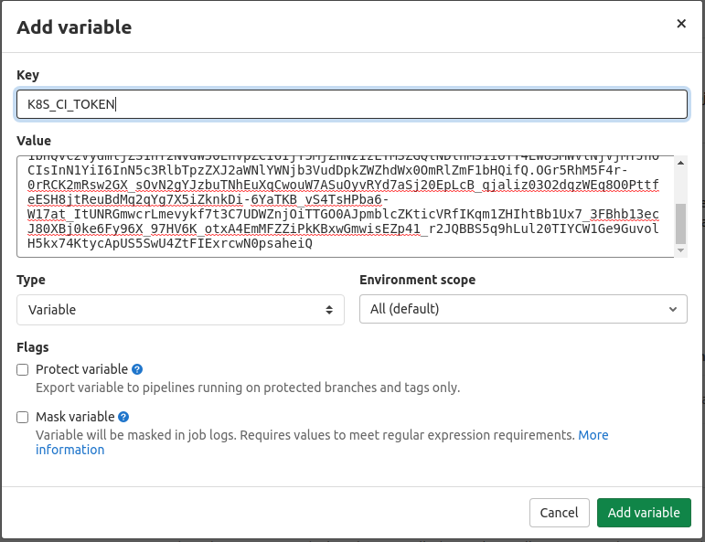

# Многоэтапные пайплайны с зависимостями

После того, как Вася с Петиной помощью шаблонизировал сборку докер-образов, он захотел навести порядок в политике ветвления в своём проекте. Ещё Петя ему давно капал на мозги, жалуясь, что место в gitlab-registry не резиновое и скоро будет включена политика удаления старых образов. Самое дурацкое заключалось в том, что иногда новые образы собирались даже на невалидный код, а уж об отслеживании качества кода вообще речи не шло. Вася решил переписать пайплайн, чтобы заставить разработчиков следовать принятым в компании стандартам.

Помогите Васе переписать свой пайплайн. Важно, чтобы

- Сначала запускались линтеры для файлов с исходным кодом, а также проверялось, что yaml-файлы корректно отформатированы.
- Нужно, чтобы запускались юнит-тесты.
- Необходимо выполнить небольшое количество e2e тестов.
- Только после этого стоит приложение заворачивать в докер-контейнер с тегом `${CI_COMMIT_SHORT_SHA}` и деплоить на дев-среду, но только если пайплайн выполняется из фича-ветки разработчика.
- Если пайплайн выполняется из мастер-ветки, контейнер также собирается, но деплой происходит на staging.
- Если коммит тегируется, в мастер-ветке, собранный в предыдущем пункте контейнер скачивается, ему присваивается новый тег, равный тегу коммита и этот убраз уже деплоится в production.

Васино приложение написано на go. Код Васиного приложения лежит в `08-lecture/verybigdataapp`. Создайте репозиторий и положите туда исходники, а затем настройте должным образом пайплайн.

## Как деплоить в кубер?

Предварительно сходите на мастер-ноду кластера k8s и подготовьте окружения для деплоя:

```
kubectl create ns dev
kubectl create ns staging
kubectl create ns production
kubectl create secret docker-registry --docker-username=<имя_пользователя> \
  --docker-password=<ваш_пароль> \
  --docker-server=registry.slurm.io -n dev slurm-registry
kubectl create secret docker-registry --docker-username=<имя_пользователя> \
  --docker-password=<ваш_пароль> \
  --docker-server=registry.slurm.io -n staging slurm-registry
kubectl create secret docker-registry --docker-username=<имя_пользователя> \
  --docker-password=<ваш_пароль> \
  --docker-server=registry.slurm.io -n prod slurm-registry
kubectl create clusterrolebinding --clusterrole=cluster-admin --serviceaccount=default:default ci
kubectl get secrets -ojsonpath='{.items[0].data.token}' | base64 -d ; echo
```

Вывод последней команды сохраните. Перейдите в настройки CI/CD своего репозитория в раздел переменных (Settings -> CI/CD -> Variables) и создайте переменную `K8S_CI_TOKEN`:



Эти действия необходимы для авторизации в кластере, а более подробно тема будет освещена в 10-й лекции.

Получите адрес API кластера выполнив

```
kubectl config view -ojsonpath='{.clusters[0].cluster.server}' ; echo
```

и аналогично сохраните его в переменную `K8S_API_URL`.

Проверьте манифесты в директории `manifests/` в исходниках. Замените `__SLURM_USERNAME__` на ваше имя пользователя.

После этого джоб по деплою в кубер будет выглядеть приблизительно так:

```yaml
Deploy:
  stage: deploy
  image:
    name: bitnami/kubectl:1.18.2
    entrypoint: [""]
  variables:
    KUBECONFIG: /tmp/.kubeconfig
  script:
  - kubectl config set-cluster k8s --insecure-skip-tls-verify=true --server=$K8S_API_URL
  - kubectl config set-credentials ci --token=$K8S_CI_TOKEN
  - kubectl config set-context ci --cluster=k8s --user=ci
  - kubectl config use-context ci
  - <команды для замены переменных в манифестах>
  - <команды для применения манифестов>
```

## Как собирать докеры?

Шаблоны, которые писали Вася с Петей лежат в директории `08-lecture/01-vasya-and-his-pipeline`. Возьмите их за основу. Для корректной работы на шаренных раннерах в gitlab.slurm.io, однако, понадобятся некоторые изменения. Отталкивайтесь от следующего шаблона:

```yaml
include:
- local: /docker.yml

Docker:
  stage: docker
  extends: .build_docker_image
  variables:
    DOCKER_HOST: ""
  services: []
  tags:
  - docker
  except:
  - tags
```

по необходимости изменяя только поле `script`.

### Подсказки

<details>
<summary>Какими инструментами пользоваться для валидации кода на go и ямлов?</summary>

- golangci-lint [docker](https://hub.docker.com/r/golangci/golangci-lint); [github](https://github.com/golangci/golangci-lint)
- yamllint [docker](https://hub.docker.com/r/cytopia/yamllint); [github](https://github.com/adrienverge/yamllint)
- Встроенные инструменты для тестирования go запускаются командой `go test ./...`.

</details>

<details>
<summary>Как проводить e2e-тестирование?</summary>

Васино приложение производит высоконагруженные вычисления и предоставляет клиентам http-интерфейс на порту 58080. Но если высокого RPS нет, приложение можно запустить и внутри одного из этапов пайплайна. В том же этапе, где приложение будет создано, запустите его фоном после компиляции и отправьте несколько тестовых запросов:

```
$ curl "localhost:58080/?a=6&b=4"
10
$ curl "localhost:58080/?a=2&b=3"
5
```

С помощью современнейших моделей машинного обучения и предиктивной аналитики сервер возвращает сумму значений в полях `a` и `b`. Простенькое e2e-тестирование можно реализовать подобным методом:

```
RESULT=$(curl "localhost:58080/?a=6&b=4")
'[[ "$RESULT" == "10" ]]' # подобные конструкции в ямле необходимо заворачивать в кавычки
```

Если это не так, вторая команда вернёт exit-code 1 и пайплайн будет считаться неуспешным.

</details>

<details>
<summary>Что-то юнит и e2e-тесты сломаны...</summary>

Поищите ошибку в `verybigdataapp/pkg/bigdatafuncs/funcs.go`.

</details>

<details>
<summary>Ну, ладно, как пайплайн-то строить?</summary>

Нужны следующие этапы:

- validate. Здесь должны запускаться все линтеры и юнит-тесты в трёх параллельных джобах.
- build. Здесь будет компиляция бинаря и e2e тесты.
- docker. Здесь будет собираться докер образ.
- deploy. Здесь можно по-разному решить задачу, например `if [[ "${CI_COMMIT_REF_NAME}" == "master" ]] ; then ENVIRONMENT=staging ; else ENVIRONMENT=dev ; fi`. В данном случае можно ограничиться плейсхолдерами, например `echo deployed app to $ENVIRONMENT`, так как нюансы целевого окружения вне рамок текущего задания.
- retag. `docker pull image:${CI_COMMIT_SHORT_SHA}; docker tag image:${CI_COMMIT_SHORT_SHA} image:${CI_COMMIT_TAG}; docker push image:${CI_COMMIT_TAG}`.
- release. Как и в deploy, достаточно плейсхолдера `echo deployed app to production`.

</details>

<details>
<summary>А как эти хитрые условия выполнять?</summary>

На этапы пайплайна нужны следующие ограничения:

- validate - не запускается на тегированных коммитах.
- build - не запускается на тегированных коммитах. Сохраняет собранный бинарь в артифактах.
- docker - не запускается на тегированных коммитах.
- deploy - не запускается на тегированных коммитах.
- retag - запускается только на тегированных коммитах.
- release - запускается только на тегированных коммитах.

<details>
<summary>Можно поподробнее?</summary>

```
artifacts:
  paths:
  - verybigdataapp
```

[Ссылка](https://docs.gitlab.com/ee/ci/yaml/#artifactspaths)

```
except:
- tags
```

```
only:
- tags
```

[Ссылка](https://docs.gitlab.com/ee/ci/yaml/#onlyexcept-basic)

</details>

</details>

<details>
<summary>Что именно нужно делать с манифестами?</summary>

```
sed -i "s|__ENVIRONMENT__|${ENVIRONMENT}| ; s|__CI_REGISTRY_IMAGE__|${CI_REGISTRY_IMAGE}| ; s|__IMAGE_TAG__|${CI_COMMIT_SHORT_SHA}|" manifests/*.yml # Если деплой идёт на dev или staging
sed -i "s|__ENVIRONMENT__|${ENVIRONMENT}| ; s|__CI_REGISTRY_IMAGE__|${CI_REGISTRY_IMAGE}| ; s|__IMAGE_TAG__|${CI_COMMIT_TAG}|" manifests/*.yml # Если деплой идёт на prod
kubectl apply -n $ENVIRONMENT -f manifests/
```

</details>

<details>
<summary>Всё равно не получается</summary>

Решение задачи приведено в директории `08-lecture/hints`.

</details>
