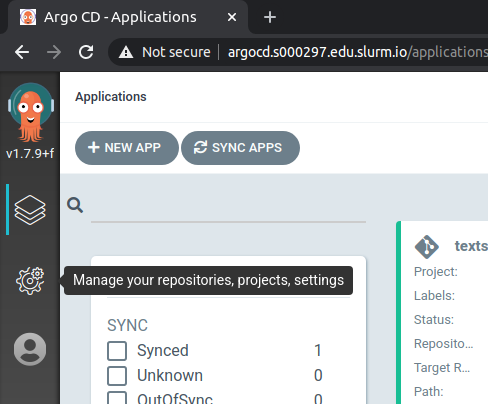
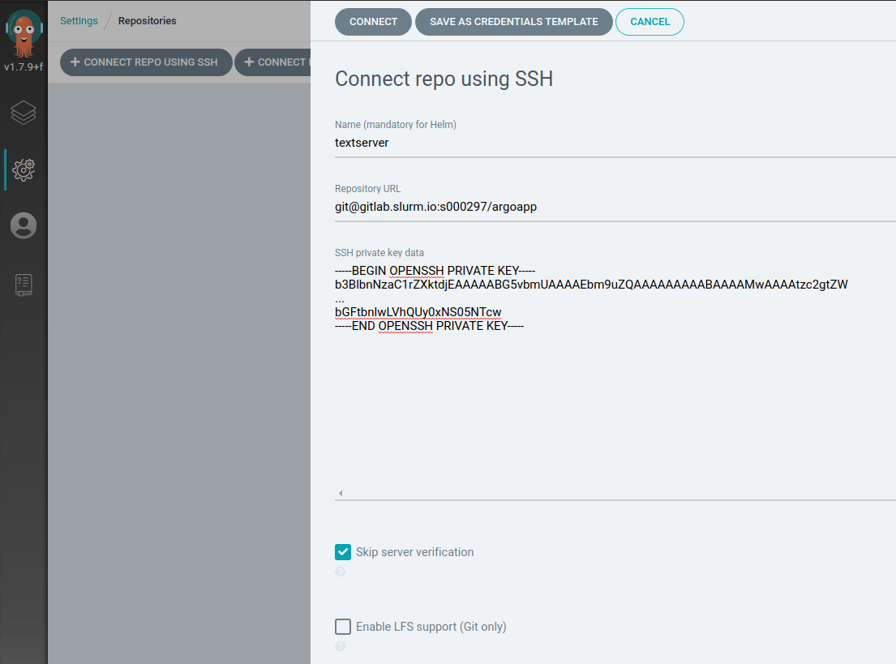
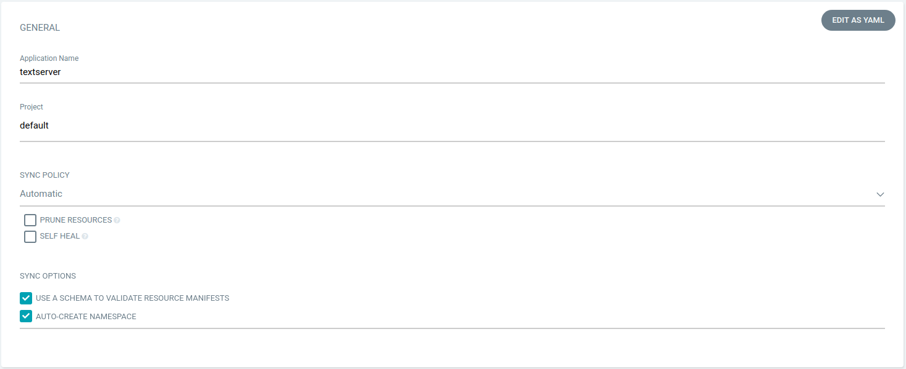
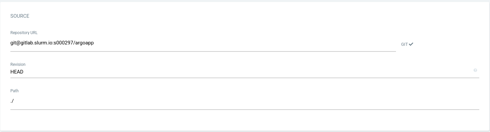
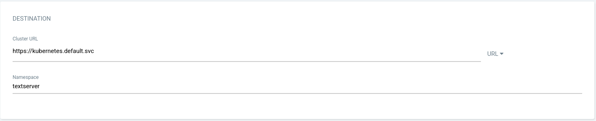
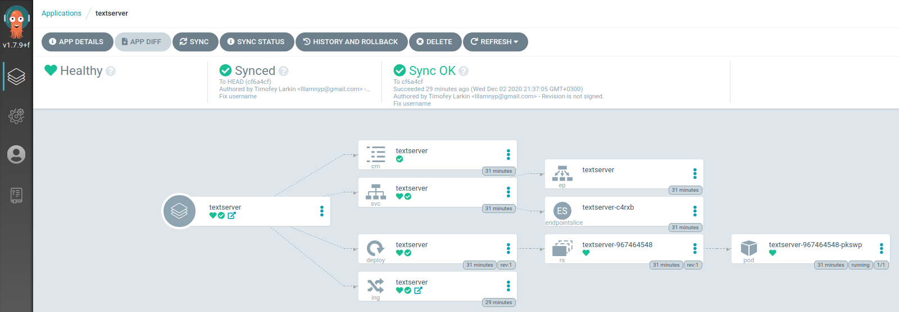
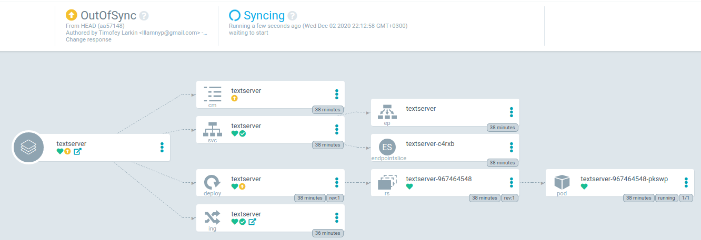

# Установка и применение argocd

[ArgoCD](https://argoproj.github.io/argo-cd/) один из популярных инструментов для гитопса. Он предоставляет удобный UI для отслеживания приложений запущенных в кластере k8s, отслеживает рассинхронизацию гит-репозитория и состояния приложения в кластере и, в зависимости от настроек, автоматически возвращает приложения в желаемое состояние.

Шаги по установке необходимо выполнять на мастер-ноде кластера k8s:

```
$ ssh sbox.slurm.io
$ ssh master-1.<имя_пользователя> # например, s000001
$ sudo -i
#
```

Склонируйте репозиторий курса и перейдите в директорию `11-lecture/argocd`.

Так как argo использует http/2, дефолтный nginx-ingress-controller с ним несовместим. Поэтому TLS сессия не должна на nginx'е завершаться. Чтобы включить такую возможность, необходимо пропатчить демонсет nginx'а:

```
kubectl patch ds -n ingress-nginx nginx-ingress-controller --type='json' \
  -p='[{"op": "add", "path": "/spec/template/spec/containers/0/args/-", "value":"--enable-ssl-passthrough"}]'
```

Затем нужно отредактировать 12-ю строчку `ingress.yml`, подставив своё имя пользователя вместо `__SLURM_USERNAME__`:

```
  - host: argocd.__SLURM_USERNAME__.edu.slurm.io
```

После этого можно запустить argo в кластере:

```
kubectl create ns argocd
kubectl apply -f .
```

По-умолчанию, пароль администраторской учётки устанавливается, как имя пода сервера argo. Его можно вывести на экран следующей командой:

```
kubectl get pods -n argocd -l app.kubernetes.io/name=argocd-server -o name | cut -d'/' -f 2
```

После чего можно перейти по ссылке `https://argocd.<ваше_имя_пользователя>.edu.slurm.io` и авторизоваться на сервере арго с логином `admin` и паролем, полученным выше.

Теперь создайте новый репозиторий и добавьте в него всё содержимое директории `11-lecture/argoapp`. **Не забудьте исправить `__SLURM_USERNAME__` в файле `values.yaml`**, прежде чем коммитить изменения.

После этого надо настроить доступ к репозиторию со стороны сервера арго и добавить новый "Application" - т.е. мета-ресурс, описывающий приложение и его гит-репозиторий, за которым сервер арго будет следить.

Сначала из меню слева выберите пункт "settings".



Там перейдите к пункту repositories, а затем Connect repo using ssh. Заполните поля по подобию скриншота ниже для своего репозитория:



Когда репозиторий будет создан, выберите пункт "Create application" и заполните, как на примере:







Нажимайте create и через некоторое время веб-интерфейс отобразит похожее состояние:



По запросу

```
curl argoapp.<ваше_имя_пользователя>.edu.slurm.io
```

получим ответ

```
Hello from argo!
```

Теперь если изменить 38-ю строку в файле `values.yaml` в созданном репозитории и отправить изменения в гит, через некоторое время интерфейс арго сигнализирует, что состояние в кластере больше не синхронизировано с состоянием гит-репозитория следующим образом:



Затем арго исправит расхождения, в чём можно будет убедиться, повторно отправив запрос:

```
curl argoapp.<ваше_имя_пользователя>.edu.slurm.io
```
